# Awesome-Generative-AI-Business-App-Creator

# Awesome-Generative-AI-Business-App-Creator 🧠 🏢

  

  

  

  

  

  

  

---

## 🌟 Top Generative AI Business App Creator Ecosystem

**Curated List of Commercial GenAI App Builders & Open-Source AI Application Frameworks**  

*Focused on Natural Language App Generation, Agentic Workflows, RAG Pipelines, No-Code AI Builders & Self-Hosted GenAI Platforms*

**Last updated: October 2026** 📅

---

### 📌 Overview & SEO Summary

Welcome to the ultimate curated directory of **generative AI business app creators**, **open-source AI application frameworks**, and **agentic workflow builders**. Whether you are looking for enterprise-grade commercial solutions (such as *Amazon Q Apps*, *Retool AI*, and *Microsoft Power Apps Copilot*), or self-hostable open-source alternatives (like *Dify*, *Flowise*, and *n8n*), this list covers category leaders, natural language app generation, and privacy-respecting AI business applications.

**Key Market Context:**

- **Amazon Q Apps** is the **first generative AI-powered app builder** that lets employees **describe an app in natural language** and get a working application grounded in enterprise data — no coding required.

- **Dify** is the **leading open-source LLMOps platform**, with **40K+ GitHub stars** and **visual workflow builder** for AI agents with RAG pipelines.

- **Flowise** provides **drag-and-drop LLM app development** with **25K+ GitHub stars** and **multi-agent workflows**.

---

## 📑 Table of Contents

- [🏢 SaaS & Commercial Platforms](#-saas--commercial-platforms)

- [🔓 Open-Source GitHub Projects](#-open-source-github-projects)

- [🛠️ How to Contribute](#%EF%B8%8F-how-to-contribute)

- [📊 Star History](#-star-history)

- [🤝 Support & Sponsorship](#-support--sponsorship)

- [⚠️ Disclaimer](#%EF%B8%8F-disclaimer)

---

## 🏢 SaaS / Commercial Platforms

The generative AI business app creator market spans **enterprise AI app builders** (Amazon Q Apps, Microsoft Power Apps Copilot) that generate **apps from natural language grounded in enterprise data**, **low-code platforms with AI** (Retool AI, Appsmith AI, ToolJet AI) that add **AI-powered app generation to existing internal tool builders**, and **AI-native platforms** (Dify, Flowise, Lindy) that focus on **agentic workflows and RAG pipelines**. **Amazon Q Apps** is **included with Amazon Q Business** at **$20/user/month** . **Retool AI** starts at **$10/user/month** with AI features on higher tiers . **Microsoft Power Apps Copilot** is **$20/user/month** for Premium . **Dify Cloud** starts at **$59/month** . **Lindy AI** starts at **$30/user/month** .

| SaaS / Commercial Platform | Company / Owner | Valuation / Market Cap | Standard Edition Starting Price | Free Tier / Free Trial Limits | Description |

| :--- | :--- | :--- | :--- | :--- | :--- |

| **[Amazon Q Apps](https://aws.amazon.com/q/apps/)** ☁️ | Amazon | ~$2.0 Trillion | **Included with Amazon Q Business** ($20/user/month)  | **Free tier: 30-day trial**  | **AWS-native GenAI app builder** — **Describe an app in natural language** and get a working application grounded in enterprise data . **No coding required** . **Connects to 40+ enterprise data sources via Amazon Q Business** . **The first GenAI-powered business app creator** . |

| **[Retool AI](https://retool.com/ai)** 🛠️ | Retool | ~$3.2 Billion | **$10/user/month** (Standard); AI features on higher tiers  | **Free: 5 users**  | **Internal tool builder with AI** — **AI-powered app generation with Retool AI** . **Connects to any database or API** . **AI actions for text summarization, classification, and generation** . |

| **[Microsoft Power Apps Copilot](https://powerapps.microsoft.com/)** 🔷 | Microsoft | ~$3.90 Trillion | **$20/user/month** (Premium) | **Free: limited with Microsoft 365**  | **Microsoft-native low-code platform** — **Copilot for app generation** . **Describe your app in natural language** . **Canvas and model-driven apps** . **Deep integration with Microsoft 365 and Dataverse** . |

| **[Appsmith AI](https://www.appsmith.com/)** 📦 | Appsmith | Private | **$15/user/month** (Business) | **Free: 5 users, unlimited apps**  | **Open-source low-code platform with AI** — **AI-powered app generation with Appsmith AI** . **45+ UI widgets** . **Connects to any database or API** . |

| **[ToolJet AI](https://www.tooljet.com/)** 🧰 | ToolJet | Private | **Custom pricing**; **free tier available**  | **Free: unlimited apps, 5 users**  | **Open-source low-code platform with AI** — **AI-powered app generation from natural language** . **60+ data connectors** . **Self-hosted or cloud** . |

| **[Dify Cloud](https://dify.ai/)** 🎨 | Dify | Private | **$59/month** (Professional) | **Free: 200 message credits**  | **LLMOps platform with agentic workflows** — **Visual workflow builder** . **RAG pipeline and agent nodes** . **Self-hosted or Dify Cloud** . **The most complete open-source LLM app builder** . |

| **[Flowise](https://flowiseai.com/)** 🎯 | FlowiseAI | Private | **$35/month** (Starter) | **Free: 2 chatflows, 100 predictions/month**  | **Drag-and-drop LLM app builder** — **Visual editor for chatbots and agents** . **Self-host free** . **The most accessible open-source AI app builder** . |

| **[Lindy AI](https://www.lindy.ai/)** 🧑‍💼 | Lindy | Private | **$30/user/month** (Plus); **$99.99** (Pro)  | **7-day free trial** with full Pro features  | **AI personal assistant for work** — **Inbox management, meeting scheduling, and note-taking** . **Shared workspace credit pool** . |

| **[Relevance AI](https://relevanceai.com/)** 📊 | Relevance AI | Private | **$19/month** (Pro, annual) | **Free: 200 actions/month**  | **AI workforce platform** — **Build agents to handle GTM workloads** . **2,000+ app integrations** . |

| **[BaseHub AI](https://basehub.com/)** 📦 | BaseHub | Private | **Custom pricing**  | **Free trial available**  | **AI-powered content backend** — **Generate structured content with AI** . **Git-based content management** . |

---

## 🔓 Open-Source GitHub Projects

*Sorted by GitHub_Stars_Count (Descending)* 🌟

- **[Dify](https://github.com/langgenius/dify)**   

  **LLMOps platform with agentic workflows**, Apache-2.0 licensed. **40K+ GitHub stars** — **visual workflow builder combining LLM nodes, knowledge retrieval, tools, and conditional logic** . **RAG pipeline and agent nodes** . **Self-hosted or Dify Cloud** . **The most complete open-source LLM app builder** . 🎨

- **[Flowise](https://github.com/FlowiseAI/Flowise)**   

  **Drag-and-drop LLM app builder**, Apache-2.0 licensed. **25K+ GitHub stars** — **visual editor for chatbots, agents, and multi-agent workflows** . **Self-host free** . **Model-agnostic** — supports multiple LLM providers . 🎯

- **[n8n](https://github.com/n8n-io/n8n)**   

  **Workflow automation with AI capabilities**, Sustainable Use License. **40K+ GitHub stars** — **visual workflow builder with 400+ integrations** . **AI nodes for LLM integration** . **Self-hosted or cloud** . **The most powerful open-source automation platform** . 🔄

- **[Appsmith](https://github.com/appsmithorg/appsmith)**   

  **The leading open-source low-code platform**, Apache-2.0 licensed. **35K+ GitHub stars** — **build internal tools with drag-and-drop UI** . **45+ UI widgets** . **Connects to any database or API** . **Self-hosted or cloud** . 🛠️

- **[ToolJet](https://github.com/ToolJet/ToolJet)**   

  **Open-source low-code platform for internal tools**, AGPL-3.0 licensed. **30K+ GitHub stars** — **AI-powered app generation** from natural language . **60+ data connectors** . **Self-hosted with RBAC and audit logs** . 🧰

- **[AnythingLLM](https://github.com/Mintplex-Labs/anything-llm)**   

  **All-in-one desktop and Docker AI application**, MIT licensed. **30K+ GitHub stars** — **RAG, AI agents, and multi-model support** . **Works with any LLM** . **Document ingestion with vector databases** . 📦

- **[LibreChat](https://github.com/danny-avila/LibreChat)**   

  **Enhanced ChatGPT clone with multi-model support**, MIT licensed. **25K+ GitHub stars** — **supports OpenAI, Anthropic, Google, and local models** . **Agents, code interpreter, and file uploads** . 💬

- **[Open WebUI](https://github.com/open-webui/open-webui)**   

  **Self-hosted ChatGPT-style UI with RAG**, MIT licensed. **124K+ GitHub stars** — **supports Ollama, OpenAI-compatible APIs, MCP servers, and RAG with 9+ vector databases** . **Multi-user RBAC and LDAP/SSO** . 🔒

- **[Dify (Self-Hosted)](https://github.com/langgenius/dify)**   

  **Open-source LLMOps platform**, Apache-2.0 licensed. **Self-hosted deployment for full data sovereignty** . **Visual workflow builder for AI agents** . **RAG pipeline and knowledge base** . 🎨

- **[Budibase](https://github.com/Budibase/budibase)**   

  **Open-source low-code platform for internal tools**, GPL-3.0 licensed. **20K+ GitHub stars** — **build CRUD apps, admin panels, and forms** . **Connects to PostgreSQL, MySQL, MongoDB, and REST APIs** . **Automation workflows and RBAC** . 🏗️

- **[Refine](https://github.com/refinedev/refine)**   

  **React-based framework for building internal tools**, MIT licensed. **20K+ GitHub stars** — **headless by design** . **Connects to 15+ backend services** . ⚛️

- **[Bubble (Open Source Alternatives)](https://github.com/topics/no-code)**   

  **Open-source no-code platform alternatives**, open-source. **Community-curated list of no-code and low-code platforms** . **The starting point for self-hosted app builders** . 🗂️

---

## 🛠️ How to Contribute

Contributions are welcome! Follow these steps to submit new GenAI app creator platforms or open-source AI application software:

1. 🍴 **Fork** the repository.

2. 📝 **Add/edit** entries in `README.md` maintaining table/list structure and formatting.

3. 🔗 Include project title, official website/GitHub link, exact Stars_Count, license, and brief description.

4. 🚀 Submit a **Pull Request** with a descriptive summary of your changes.

---

## 📊 Star History

---

## 🤝 Support & Sponsorship

If you find this generative AI business app creator repository useful, please consider supporting the project:

- ⭐ **Star** this repository to increase visibility!

- 🔀 **Fork** and share with fellow developers, business analysts, and open-source advocates.

- ☕ **Sponsor & Buy Me a Coffee**: Support ongoing open-source curation via the [GitHub Sponsor Dashboard](https://github.com/sponsors/ishandutta2007).

---

## ⚠️ Disclaimer

- This is a **community-curated** list — not exhaustive and not an endorsement. ℹ️

- **Amazon Q Apps is included with Amazon Q Business** at **$20/user/month** — **the first GenAI-powered business app creator** that generates apps from natural language grounded in enterprise data .

- **Dify is the leading open-source LLMOps platform** with **40K+ GitHub stars** and **visual workflow builder for AI agents** . **Flowise provides drag-and-drop LLM app development** with **25K+ GitHub stars** .

- **Open-source GenAI app builders are not turnkey** — they require **deployment, model API configuration, vector database setup, and ongoing maintenance** . **Dify requires PostgreSQL, Redis, and a vector database** . **Flowise requires Node.js and a database** . **Always validate AI app accuracy and security with a proof-of-concept** before production deployment . 🧠

---

  <b>Made with ❤️ for developers, business analysts, and open-source GenAI app advocates.</b>

